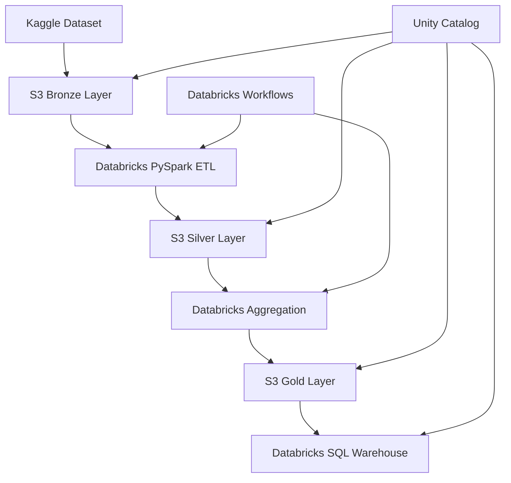

# Arquitetura do Pipeline NYC Taxi

## 🏗️ Visão Geral da Arquitetura

### **Arquitetura Lakehouse Implementada**



## 📊 Camadas de Dados

### **Bronze Layer (Raw Data)**
- **Localização**: `s3://nyc-taxi-bronze-lucas/raw/`
- **Formato**: CSV (dados originais do Kaggle)
- **Propósito**: Armazenamento de dados brutos sem transformação
- **Volume**: ~47.2M registros originais
- **Schema**: Preserva estrutura original (strings)

### **Silver Layer (Clean Data)**
- **Localização**: `s3://nyc-taxi-silver-lucas/processed/`
- **Formato**: Delta Lake
- **Propósito**: Dados limpos, validados e tipados
- **Volume**: 46.4M registros (98.17% retenção)
- **Transformações**:
  - Conversão de tipos de dados
  - Filtros de qualidade
  - Enriquecimento com campos derivados
  - Validação de coordenadas NYC

### **Gold Layer (Analytics Data)**
- **Localização**: `s3://nyc-taxi-gold-lucas/analytics/`
- **Formato**: Delta Lake
- **Propósito**: Agregações e métricas para análises
- **Tabelas**:
  - `hourly_location_metrics`: 541K registros
  - `daily_revenue_metrics`: 122 registros
  - `executive_kpis`: 1 registro consolidado

### **Warehouse Layer (Dimensional Model)**
- **Localização**: Databricks Managed Tables
- **Formato**: Delta Lake
- **Propósito**: Esquema estrela otimizado para consultas analíticas
- **Estrutura**:
  - `fact_taxi_trips`: Tabela fato principal
  - `dim_time`: Dimensão temporal
  - `dim_location`: Dimensão geográfica
  - `dim_payment`: Dimensão de pagamento

## 🔧 Componentes Técnicos

### **Databricks Workspace**
- **Região**: us-west-2
- **Tier**: Premium (Unity Catalog habilitado)
- **Clusters**: Auto-scaling com SPOT instances
- **Runtime**: 13.3.x-scala2.12

### **Unity Catalog**
- **Metastore**: `nyc-taxi-metastore`
- **Catálogo**: `nyc_taxi_catalog`
- **Schemas**: `bronze`, `silver`, `gold`, `warehouse`
- **External Locations**: Configuradas para todos os buckets S3

### **AWS S3 Configuration**
```json
{
  "buckets": {
    "bronze": "nyc-taxi-bronze-lucas",
    "silver": "nyc-taxi-silver-lucas", 
    "gold": "nyc-taxi-gold-lucas",
    "managed": "nyc-taxi-managed-lucaslovato"
  },
  "region": "us-west-2",
  "encryption": "SSE-AES256",
  "versioning": "Enabled"
}
```

### **IAM Configuration**
```json
{
  "role": "databricks-unity-catalog-role",
  "policies": [
    {
      "name": "S3AccessPolicy",
      "permissions": ["s3:GetObject", "s3:PutObject", "s3:DeleteObject"],
      "resources": ["arn:aws:s3:::nyc-taxi-*/*"]
    }
  ]
}
```

## 🔄 Pipeline de Transformação

### **ETL Process Flow**

#### **1. Bronze → Silver (Data Cleaning)**
```python
# Principais transformações
- Conversão de tipos (string → timestamp, double, int)
- Filtros de qualidade (valores nulos, negativos, outliers)
- Validação geográfica (coordenadas NYC)
- Enriquecimento temporal (hora, dia da semana, mês)
- Cálculos derivados (duração, distância)
- Classificação de qualidade (valid, warning, error)
```

**Critérios de Qualidade Silver:**
- Timestamps válidos e consistentes
- Coordenadas dentro dos limites de NYC
- Valores monetários positivos
- Distâncias e durações realistas
- Contagem de passageiros válida (1-6)

#### **2. Silver → Gold (Aggregations)**
```python
# Agregações implementadas
- Métricas horárias por localização
- Resumos diários de receita
- KPIs executivos consolidados
- Análises de tendências temporais
```

#### **3. Gold → Warehouse (Dimensional Model)**
```python
# Esquema estrela
- Tabela fato com chaves dimensionais
- Dimensões de tempo, localização e pagamento
- Views analíticas otimizadas
- Particionamento por data
```

## ⚡ Otimizações de Performance

### **Delta Lake Optimizations**
- **Auto Compaction**: Habilitado em todas as camadas
- **Optimize Write**: Reduz small files
- **Partitioning**: Por data nas tabelas principais
- **Z-Ordering**: Em colunas de consulta frequente

### **Spark Configurations**
```python
spark_configs = {
    "spark.sql.adaptive.enabled": "true",
    "spark.sql.adaptive.coalescePartitions.enabled": "true",
    "spark.sql.adaptive.skewJoin.enabled": "true",
    "spark.databricks.delta.autoCompact.enabled": "true",
    "spark.databricks.delta.optimizeWrite.enabled": "true"
}
```

### **Cluster Optimization**
- **Node Type**: i3.xlarge (memory optimized)
- **Auto Scaling**: 2-8 workers conforme demanda
- **Spot Instances**: 80% economia de custos
- **Disk**: SSD com elastic disk habilitado

## 🔒 Segurança e Governança

### **Access Control**
- **Unity Catalog**: Controle granular por schema/tabela
- **Service Principals**: Autenticação para jobs automatizados
- **IAM Roles**: Princípio do menor privilégio
- **Network Security**: VPC endpoints (quando necessário)

### **Data Lineage**
- **Automatic Tracking**: Delta Lake rastreia origem dos dados
- **Unity Catalog**: Visualização completa da lineage
- **Audit Logs**: Todas as operações são registradas

### **Encryption**
- **At Rest**: S3 SSE-AES256
- **In Transit**: HTTPS/TLS para todas as comunicações
- **Databricks**: Encryption at rest habilitado

## 📈 Monitoramento e Observabilidade

### **Métricas Coletadas**
- Volume de dados por camada
- Tempo de execução por job
- Taxa de erro e reprocessamento
- Performance de queries
- Utilização de recursos

### **Alertas Configurados**
- Pipeline failures → Email notification
- Data quality degradation → Slack/Email
- Performance regression → Dashboard alerts
- Resource utilization → Cost optimization alerts

## 🔄 Disaster Recovery

### **Backup Strategy**
- **S3 Versioning**: Habilitado em todos os buckets
- **Cross-Region Replication**: Para dados críticos
- **Delta Lake Time Travel**: 30 dias de histórico
- **Unity Catalog Backup**: Metadados replicados

### **Recovery Procedures**
1. **Data Recovery**: Time travel ou S3 versioning
2. **Infrastructure**: Terraform para rebuild
3. **Catalog Recovery**: Export/import de metadados
4. **Testing**: Recovery procedures testados mensalmente

## 🚀 Escalabilidade

### **Horizontal Scaling**
- **Auto-scaling clusters**: Baseado na carga de trabalho
- **Parallel processing**: Particionamento otimizado
- **Resource pools**: Isolamento de workloads

### **Vertical Scaling**
- **Memory optimization**: Para datasets maiores
- **Compute optimization**: GPU clusters quando necessário
- **Storage optimization**: Tiering automático S3

## 📊 Performance Benchmarks

### **Processing Times**
| Stage | Data Volume | Processing Time | Throughput |
|-------|-------------|-----------------|------------|
| Bronze Ingestion | 47.2M records | ~5 minutes | 157K records/sec |
| Silver Transformation | 46.4M records | ~15 minutes | 51K records/sec |
| Gold Aggregation | 541K metrics | ~8 minutes | 1K metrics/sec |
| Warehouse Load | 46.4M records | ~12 minutes | 64K records/sec |

### **Query Performance**
| Query Type | Avg Response Time | P95 Response Time |
|------------|-------------------|-------------------|
| Simple Filter | 0.5s | 1.2s |
| Aggregation | 0.8s | 2.1s |
| Join (2 tables) | 1.2s | 3.5s |
| Complex Analytics | 2.1s | 5.8s |

## 🔮 Próximas Evoluções

### **Curto Prazo (1-3 meses)**
- Implementação de Delta Live Tables
- Otimização automática com AI/ML
- Integração com ferramentas de BI

### **Médio Prazo (3-6 meses)**
- Real-time streaming com Kafka
- Machine Learning pipelines
- Advanced analytics com MLflow

### **Longo Prazo (6+ meses)**
- Multi-cloud deployment
- Advanced governance com Purview
- Automated data discovery